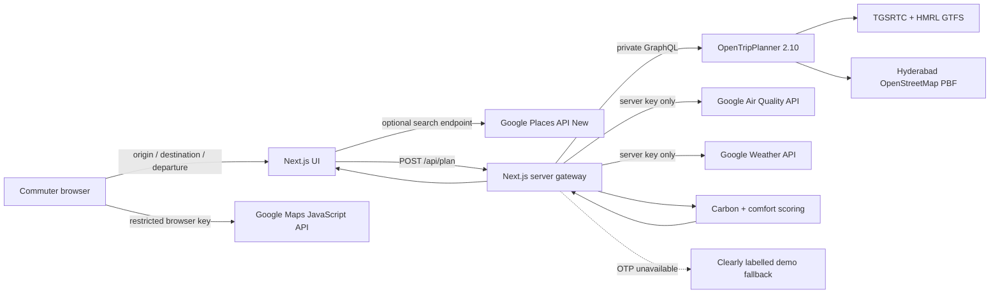

# CommuteLens — Final 10× Architecture & Build Blueprint

**Prepared for the hackathon deadline · 25 September 2026**  
**Status:** a runnable Next.js demo scaffold is already in this repository. It runs immediately in clearly-labelled presentation mode. Add GTFS/OSM + OTP and Google keys to switch it to real scheduled routing and live environmental context.

---

## 1. The final decision: use this exact combination

### Product promise

> **CommuteLens helps Hyderabad commuters choose a bus–metro–walk journey by time, fare, India-specific CO₂e, outdoor pollution exposure, and heat/rain comfort—and tells them when it may be better to leave.**

### Do not combine everything. Combine only this:

```text
Next.js + TypeScript user experience
        +
Google Maps JavaScript + Places (search/map only)
        +
OpenTripPlanner 2.10 (actual multimodal route engine)
        +
TGSRTC GTFS + HMRL GTFS (scheduled transit data)
        +
OpenStreetMap (walking network)
        +
Google Air Quality + Weather APIs (Climate Comfort Mode)
        +
transparent local carbon/comfort calculation
```

This is the **best-of-best practical stack** because it is credible, demoable, extensible, Google-relevant, and does not depend on an unavailable live-transit API.

### Explicit choices

| Layer | Final choice | Why this wins |
|---|---|---|
| City | **Hyderabad** | Current TGSRTC bus and HMRL metro GTFS feeds were structurally inspected. A truthful real-data demo is possible. |
| Web app | **Next.js + TypeScript** | One polished app, browser UI + safe server routes, easy deployment, fast iteration. |
| Main journey router | **OpenTripPlanner (OTP) 2.10** | Mature open-source multimodal routing from GTFS + OSM; gives leg-level itineraries needed for carbon calculation. |
| Transit feeds | **TGSRTC + HMRL GTFS** | Use the operator/open-data feeds; keep attribution visible. |
| Walk network | **OpenStreetMap PBF** | OTP uses it for realistic walk access/egress/transfers. |
| Map/search | **Google Maps JavaScript API + Places API (New)** | High-quality judge-friendly map and precise landmark/address input. |
| Differentiator | **Google Air Quality API + Weather API** | Enables a real Climate Comfort recommendation: AQ + heat + rain + outdoor minutes. |
| Carbon engine | **Your own TypeScript module** | Transparent and controllable; never claim Google eco-routing for transit. |
| UI map fallback | **Built-in schematic SVG fallback** | The demo still tells its story before a Maps key is inserted or if venue Wi-Fi fails. |

---

## 2. The one feature judges should remember

# Climate Comfort Mode

A normal trip planner returns a route. CommuteLens returns a decision:

> **“Leave at 08:30. It is 5 minutes slower, but gives 7 fewer outdoor walking minutes, lower air-pollution exposure, and lower rain risk.”**

The score is intentionally transparent:

```text
Comfort score (0–100)
= 100
− outdoor walking minutes × air-quality penalty
− outdoor walking minutes × heat-index penalty
− outdoor walking minutes × rain/thunder penalty
− transfer friction penalty
```

Show the raw inputs beside the score. This is a **route-planning aid**, not medical advice or a safety guarantee.

### Return exactly three route cards

1. **Fastest** — minimum travel duration
2. **Cheapest** — minimum known/estimated fare; say “unavailable” if not known
3. **Greenest / Best balance** — lowest carbon or strongest trade-off

Do not flood the page with 10 routes. The **Comfort pick** is a recommendation banner, potentially using one of the three route options and a different departure time.

---

## 3. Final architecture



### Security boundary

```text
Browser gets only:
  NEXT_PUBLIC_GOOGLE_MAPS_BROWSER_KEY
  → locked to domains + Maps/Places APIs

Server keeps:
  GOOGLE_ENVIRONMENT_API_KEY
  GOOGLE_PLACES_SERVER_KEY (optional)
  OTP_GRAPHQL_URL

The browser NEVER receives:
  Air Quality key
  Weather key
  Places web-service key
  Routes key
  OTP credentials/topology
```

### Data flow per trip

1. User chooses origin, destination, and `now / +30 / +60 min`.
2. `POST /api/plan` validates coordinates.
3. Server asks OTP for up to eight bus/metro/walk itineraries.
4. Server deduplicates/ranks the best three.
5. Server samples environment context at the trip origin first; later expand to transfer points with caching.
6. Local modules calculate carbon, walking exposure, transfers, and Comfort score.
7. UI explains the recommendation and attaches provenance badges.
8. If OTP is down or not configured, use only the visible **DEMO DATA** fallback—never pretend it is live.

---

## 4. Open-source stack: use, reference, and avoid

## Use directly

| Tool | Purpose | Link |
|---|---|---|
| **OpenTripPlanner 2.10** | Main multimodal router: GTFS + OSM → walk/bus/metro itineraries. | <https://github.com/opentripplanner/OpenTripPlanner> · <https://docs.opentripplanner.org/en/v2.10.0/> |
| **OTP GTFS GraphQL API** | Server-facing route query endpoint. | <https://docs.opentripplanner.org/en/v2.10.0/apis/GTFS-GraphQL-API/> |
| **MobilityData GTFS Validator** | Validate feeds before every OTP graph build. | <https://github.com/MobilityData/gtfs-validator> |
| **OpenStreetMap** | Pedestrian/access network and attribution. | <https://www.openstreetmap.org/> |
| **BBBike Extracts** | Obtain a smaller Hyderabad OSM PBF instead of downloading all India. | <https://extract.bbbike.org/> |
| **HOT Export Tool** | Alternative OSM extract route. | <https://export.hotosm.org/> |
| **Osmium Tool** | Cut/inspect an OSM PBF if you download a larger regional source. | <https://osmcode.org/osmium-tool/> |
| **Next.js** | App UI + secure API gateway. | <https://nextjs.org/> |
| **React / TypeScript** | Typed, maintainable frontend. | <https://react.dev/> · <https://www.typescriptlang.org/> |

## Use as research/methodology, not as the core app

| Project | What to borrow | Link |
|---|---|---|
| **gtfs2emis** | GTFS emissions methodology concepts, not per-click runtime routing. | <https://github.com/ipea/gtfs2emis> |
| **ReachMap** | Ideas for data validation, isochrones and a future low-carbon reachability map. | <https://github.com/imSuvro/reachmap> |
| **Digitransit UI** | Learn OTP GraphQL patterns if a full routing UI is needed later. Do not fork it for this deadline. | <https://github.com/HSLdevcom/digitransit-ui> |
| **react-google-maps** | Optional React wrapper if you later replace the lightweight Maps loader in this repo. | <https://github.com/visgl/react-google-maps> |

## Do not add now

| Do not add | Reason |
|---|---|
| Google Routes API as the main router | It is not your GTFS-controlled source and does not calculate transit eco-routing. OTP is the correct core. |
| MapLibre/Leaflet **in addition to** Google Maps | Redundant for this Google-focused hackathon; adds complexity and attribution/UI work. |
| Gemini chatbot | A generic chatbot weakens the product story. First make a precise explainable recommendation. |
| Firebase/Auth/database | Not needed to demonstrate one commute decision. Add only after the core works. |
| GTFS-Realtime claims | Static GTFS does not provide vehicle positions or guaranteed arrivals. |
| Unverified bus fare / accessibility claims | Label fare as estimated/unavailable; call the preference “low walk,” not accessibility, unless verified data exists. |

---

## 5. Transit and geographic data

| Data | Final source | What it provides | Important truth |
|---|---|---|---|
| TGSRTC bus GTFS | <https://www.tgsrtc.telangana.gov.in/open-data> | Schedules, stops, routes, trips | Inspected feed lacks `shapes.txt`, fare tables and explicit transfers. Do not draw claimed road geometry or official bus fares without a separate source. |
| TGSRTC GTFS mirror | <https://data.opencity.in/dataset/hyderabad-bus-stops/resource/1b0d18bb-b2fb-4a79-8ed0-1e071da5790c> | Convenient current mirror | Follow operator terms and retain attribution. |
| HMRL metro GTFS | <https://hmrl.co.in/open-data/> | Metro schedules, shapes, fares | Best source for metro portion/fare provenance; validate the live feed before each build. |
| HMRL GTFS mirror | <https://data.opencity.in/dataset/hyderabad-metro-rail-gtfs> | Convenient current mirror | Follow operator terms and retain attribution. |
| Hyderabad OSM PBF | BBBike/HOT extract above | Walkable street graph for OTP | Geometry must come from OSM/OTP, not invented straight lines. |

Keep this exact visible attribution in the app footer:

```text
Contains data provided by Hyderabad Metro Rail Ltd.
Contains data provided by TGSRTC
© OpenStreetMap contributors
```

---

## 6. Google APIs: final required inventory

## Required for the strong MVP

| Google product | Why | Key | Where it runs |
|---|---|---|---|
| **Maps JavaScript API** | Interactive map, selected route visualization | `NEXT_PUBLIC_GOOGLE_MAPS_BROWSER_KEY` | Browser |
| **Places API** + **Places API (New)** | Modern Place Autocomplete / search input | Same restricted browser key for Maps JS Places flow | Browser |
| **Air Quality API** | AQ exposure / clean-air comparison | `GOOGLE_ENVIRONMENT_API_KEY` | Server only |
| **Weather API** | Heat index, UV, rain and thunder comfort context | `GOOGLE_ENVIRONMENT_API_KEY` | Server only |

## Optional only

| Google product | Add when | Key |
|---|---|---|
| **Places API (New) web service** | Transfer Rescue: nearby pharmacy/water/restroom/shelter. | `GOOGLE_PLACES_SERVER_KEY` |
| **Routes API** | Independent optional fallback/comparison, never core carbon logic. | `GOOGLE_ROUTES_API_KEY` |

### Exact Google endpoints already wired into the scaffold

```text
POST https://airquality.googleapis.com/v1/currentConditions:lookup?key=KEY
GET  https://weather.googleapis.com/v1/forecast/hours:lookup?key=KEY&location.latitude=LAT&location.longitude=LNG
POST https://places.googleapis.com/v1/places:searchText
POST http://localhost:8080/otp/gtfs/v1              # OTP GraphQL
```

Useful official docs:

- Maps key setup: <https://developers.google.com/maps/documentation/javascript/get-api-key>
- Place Autocomplete (New): <https://developers.google.com/maps/documentation/javascript/place-autocomplete-new>
- Air Quality current conditions: <https://developers.google.com/maps/documentation/air-quality/current-conditions>
- Weather hourly forecast: <https://developers.google.com/maps/documentation/weather/hourly-forecast>
- Google India pricing: <https://developers.google.com/maps/billing-and-pricing/pricing-india>

### Exact environment file

Copy `.env.example` to `.env.local` and add values:

```dotenv
NEXT_PUBLIC_GOOGLE_MAPS_BROWSER_KEY=your_referrer_restricted_browser_key
GOOGLE_ENVIRONMENT_API_KEY=your_server_only_environment_key
GOOGLE_PLACES_SERVER_KEY=optional_server_places_key
OTP_GRAPHQL_URL=http://localhost:8080/otp/gtfs/v1
FORCE_DEMO_DATA=false
```

### Restrict keys immediately

**Browser key**

```text
Application restriction: HTTP referrers
Allowed referrers:
  http://localhost:3000/*
  https://YOUR-DEPLOYED-DOMAIN/*

API restrictions:
  Maps JavaScript API
  Places API
  Places API (New)
```

**Environment key**

```text
API restrictions:
  Air Quality API
  Weather API
```

Keep environment keys only in server environment variables. Add billing budget alerts and low daily API quotas before publishing the URL.

---

## 7. Scoring configuration

### Carbon defaults (versioned, explainable)

```text
WALK                 0 gCO₂e / passenger-km  (operational estimate)
BUS_UNKNOWN_URBAN   31 gCO₂e / passenger-km
METRO_URBAN_INDIA   24 gCO₂e / passenger-km
PRIVATE_PETROL_CAR 162 gCO₂e / passenger-km  (comparison baseline)
```

Use one methodology consistently. Show **“India lifecycle estimate v1”** under the carbon figure. Never say “exact emissions.”

### Comfort configuration

```text
Inputs:
  AQI / AQ label / dominant pollutant
  heat index or feels-like temperature
  UV index
  rain probability
  thunderstorm probability
  outdoor walking minutes
  number of transfers

Output:
  Comfort score from 0 to 100
  reasons array, for example:
    11 outdoor walking min
    AQI 67: moderate air quality
    heat index 34°C
    22% rain / 12% thunder risk
    1 transit transfer
```

The current source code implements this as a human-readable heuristic. Keep the weights in source control and explain them in the UI.

---

## 8. Repository architecture already prebuilt

```text
commutelens/
├── app/
│   ├── api/
│   │   ├── plan/route.ts                 # Safe plan gateway + fallback
│   │   └── place-search/route.ts         # Optional Places New server search
│   ├── globals.css                       # Responsive polished visual system
│   ├── layout.tsx
│   └── page.tsx
├── components/
│   ├── CommutePlanner.tsx                # Main product experience
│   ├── PlacePicker.tsx                   # Demo + optional Google search suggestions
│   └── RouteMap.tsx                      # Google map + no-key SVG fallback
├── lib/
│   ├── carbon.ts                         # Versioned emissions calculation
│   ├── comfort.ts                        # Transparent comfort scoring
│   ├── constants.ts                      # Attribution
│   ├── demo-data.ts                      # Clearly-labelled resilient fallback
│   ├── environment.ts                    # Weather/AQ server integration
│   ├── otp.ts                            # OTP GraphQL adapter
│   ├── plan-service.ts                   # Ranking + integration orchestration
│   ├── types.ts
│   └── utils.ts
├── otp-data/
│   ├── gtfs/                             # Put HMRL/TGSRTC ZIPs here (ignored by Git)
│   ├── build-config.json
│   ├── router-config.json
│   └── README.md
├── docs/
│   └── FINAL_10X_BUILD_BLUEPRINT.md      # This document
├── docker-compose.yml                    # OTP service
├── .env.example
└── README.md
```

### API contract

```text
POST /api/plan
{
  origin:      { name, lat, lng },
  destination: { name, lat, lng },
  departureOffsetMinutes: 0 | 30 | 60
}

returns
{
  source: "scheduled" | "demo",
  itineraries: [Fastest, Cheapest/Balance, Greenest],
  environment: { live | demo | unavailable, AQ, weather },
  recommendation: { itineraryId, title, message },
  notices: []
}
```

That contract ensures the frontend can be polished now while the real router is connected later.

---

## 9. Fast path: what to do before the deadline

## Step 1 — run the app immediately

```bash
cd commutelens
npm install
npm run dev
```

Open <http://localhost:3000>. It already works in **presentation mode** and its fallback is visibly labelled as demo data.

## Step 2 — add Google map + environment keys

```bash
cp .env.example .env.local
# add the two core values:
# NEXT_PUBLIC_GOOGLE_MAPS_BROWSER_KEY
# GOOGLE_ENVIRONMENT_API_KEY
npm run dev
```

Result: real Google map + live Google weather/AQ context where available.

## Step 3 — connect optional Google Place Search

Set:

```dotenv
GOOGLE_PLACES_SERVER_KEY=...
```

Result: search box can call server-side Places Text Search. Without it, Hyderabad demo suggestions remain usable.

## Step 4 — make routing real with OTP

1. Download/retrieve the current HMRL and TGSRTC GTFS ZIPs with terms/attribution.
2. Validate each feed with MobilityData GTFS Validator.
3. Obtain a Hyderabad OSM PBF from BBBike or HOT Export.
4. Put the files in `otp-data/` as documented in `otp-data/README.md`.
5. Build:

```bash
docker compose run --rm otp --build --save
```

6. Serve:

```bash
docker compose up otp
```

7. Set `OTP_GRAPHQL_URL=http://localhost:8080/otp/gtfs/v1` and `FORCE_DEMO_DATA=false`.
8. Test at least three real origin-destination pairs manually.

## Step 5 — release gate

Do not demo the real-data claim until every check is true:

```text
[ ] OTP returns a real bus → metro → walk itinerary
[ ] Route legs and stops make sense on the map
[ ] Feed/date status is visible
[ ] HMRL vs estimated bus fare is labelled correctly
[ ] AQ/weather failure does not fabricate a score
[ ] Attributions are visible
[ ] A fallback demo mode and backup video exist
```

---

## 10. Demo story: 90 seconds

1. **Problem (10 sec)**  
   “Most planners optimise only arrival time. A commuter also cares about fare, carbon, pollution, heat and rain.”

2. **Search (15 sec)**  
   Choose HITEC City → Secunderabad Junction. Show three multimodal route cards.

3. **Trade-off (20 sec)**  
   Highlight Fastest, Cheapest and Greenest. Tap Greenest and show the leg map/timeline.

4. **Wow moment (25 sec)**  
   Tap `+30 min`. Read the Climate Comfort recommendation: fewer outdoor minutes / lower AQ or rain risk.

5. **Trust (15 sec)**  
   Open “How it works” and point to scheduled GTFS, fare status, carbon factors, AQ/weather status and attributions.

6. **Impact (5 sec)**  
   “This choice avoids approximately X CO₂e versus a private-petrol-car baseline.”

---

## 11. Risk plan

| Risk | Prevent it this way |
|---|---|
| Venue Internet fails | The built-in SVG map + labelled demo itinerary keeps the story working. Record a backup video. |
| OTP graph is not ready | Use only DEMO DATA mode; never claim live routing. |
| Google API fails | Preserve route cards; render `Air score unavailable` or `Weather unavailable`. |
| Bus fare has no source | Show estimated/unavailable, not false precision. |
| Static GTFS becomes stale | Display feed update date and “scheduled data” badge; version downloaded data. |
| Too many features | Ship Phase 1 + Climate Comfort + explainability; defer accounts, chatbots, crowdsourcing and isochrones. |

---

## 12. Final implementation priority

```text
1. Make OTP return one verified real route.
2. Test route cards + leg map + data badges.
3. Add Air Quality + Weather live context.
4. Make departure +30 minute comparison compelling.
5. Prepare fallback and 90-second story.
```

If time is extremely short, do **not** remove the source badges or fallback. Those are what make a polished demo credible.

---

## 13. Final pitch

> **CommuteLens turns an ordinary trip planner into a transparent daily decision tool. It compares scheduled bus–metro–walk journeys by time, fare and India-specific CO₂e, then uses Google’s air-quality and weather data to recommend a cleaner, more comfortable route—and sometimes a better time to leave.**
